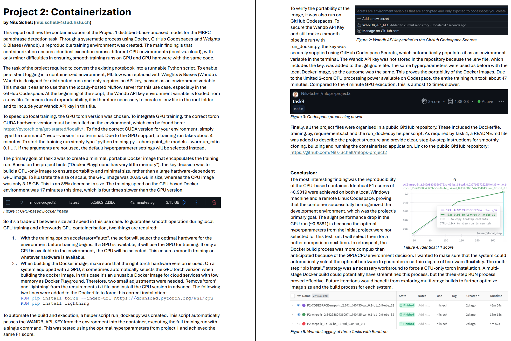

# MLOps Project 2: Containerization

A containerized `distilbert-base-uncased` model for the MRPC text classification task, created for the MLOps Project 2. This repository contains the training script, a CPU-optimized `Dockerfile` and an automation script.

## Project Report

Here is a preview of the full 2-page project report, which details the results and the process:

[](report/project-2_nils_schell_mlops.pdf)

---

## Project Info

* **Optimized CPU Image:** 3.15 GB (85% reduction)
* **(Comparison) Local GPU Environment:** 20.85 GB (4x faster with local training)
* **Core Files:**
    * `training.py`: Main training script (uses `accelerator="auto"`).
    * `run_docker.py`: Automation script (builds & starts Docker).
    * `Dockerfile`: Optimized for a small CPU build (via multi-step `pip install`).
    * `requirements.txt`: Python dependencies (does not contain `torch` or `lightning`).

---

## Quick Start: Run with Docker (Recommended)

This is the easiest way to run the project. It automatically builds the CPU-optimized Docker image and executes the training run with the best hyperparameters.

### 1. Prerequisites

* Docker Desktop (must be running)
* Python 3.10+ (only to run the start script)

### 2. Setup API Key

Create a `.env` file in the main directory of this project and add your Weights & Biases API Key as follows:
```
WANDB_API_KEY="YOUR_WANDB_API_KEY_HERE"
```

### 3. Install Dependencies & Start

```bash
# Install the python-dotenv dependency (for the helper script run_docker.py only)
pip install python-dotenv

# Automatic build and execution
python run_docker.py
```
The script will now build the mlops-project2 image and start the container. The training takes approx. 17 minutes (on CPU).

## Execution on GitHub Codespaces (Task 3)

1.  Open this repository in a Codespace.
2.  Add your `WANDB_API_KEY` as a Codespace Secret.
3.  ( `Ctrl+Shift+P` $\rightarrow$ `"Codespaces: Manage User Secrets"` $\rightarrow$ Add `WANDB_API_KEY` ).
4.  Restart the Codespace to load the secret.
5.  Run the script in the terminal:
    ```bash
    pip install python-dotenv
    python run_docker.py
    ```

The training here takes approx. 47 minutes on the 2-core CPU.

## Manual & Local Execution (Development)

### Manual Docker Build
If you don't want to use the `run_docker.py` script:

```bash
# 1. Build the image
docker build -t mlops-project2 .

# 2. Run the container (pass API key manually)
docker run --rm -e WANDB_API_KEY="YOUR_WANDB_API_KEY_HERE" mlops-project2
```

### Local Python Run (e.g., with GPU)
To run the script directly locally for development.

1. Install GPU PyTorch (Optional):
   - Check your CUDA version with `nvcc --version`.
   - Install the correct version from: [https://pytorch.org/get-started/locally/](https://pytorch.org/get-started/locally/)
2. Install Dependencies:
    ```bash
    pip install -r requirements.txt
    ```
3. Start Training (Example with non-optimal Hyperparameters):
    ```bash
    python training.py --checkpoint_dir models --learning_rate 1e-5 --train_batch_size 16 --weight_decay 0.04 --warmup_ratio 0.1
   ```

